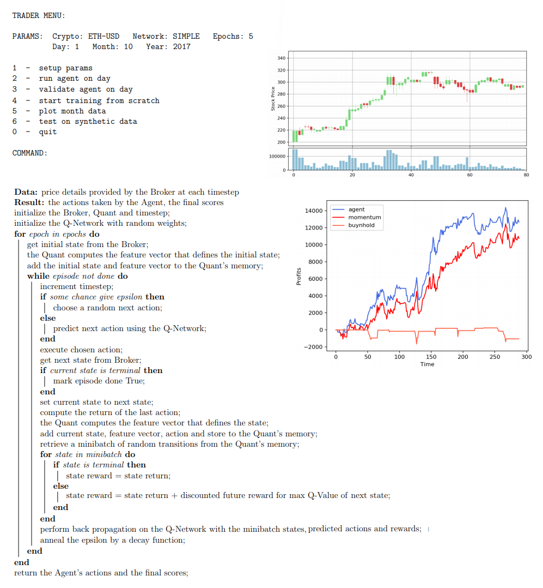

Deep Q Learning Agent that tries to learn from scratch how to trade cryptocurrencies.
The model uses LSTMs to analyse current price features in order to determine what its best action is: buy, sell or do nothing.

